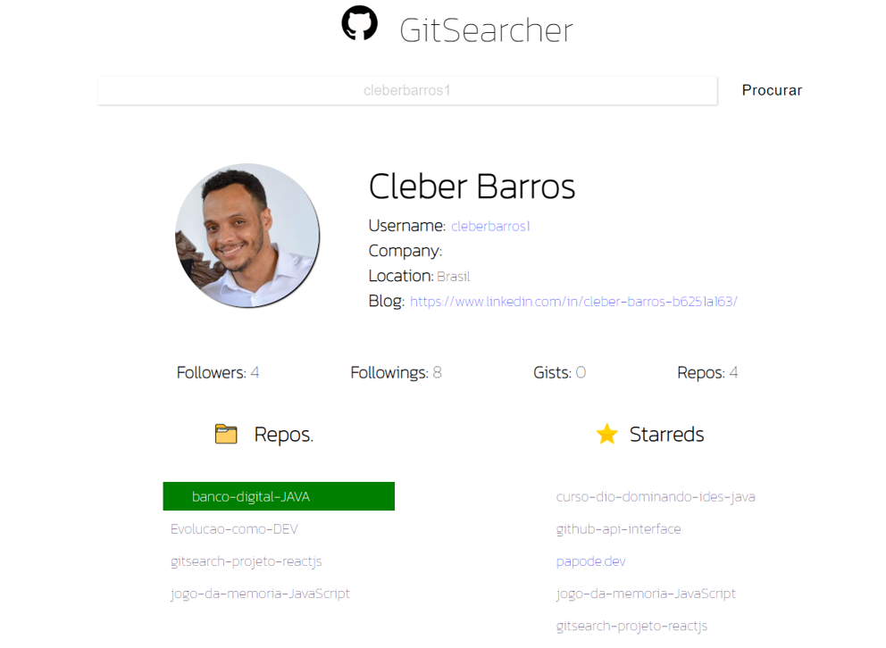
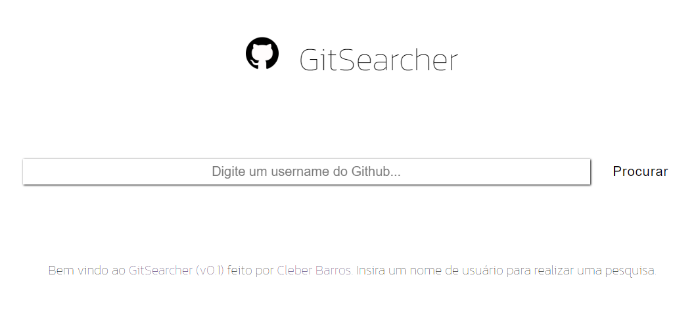
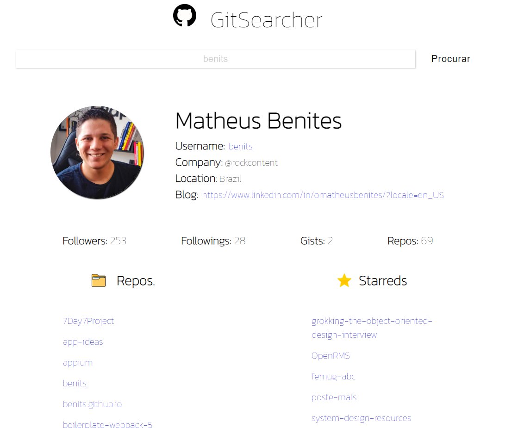
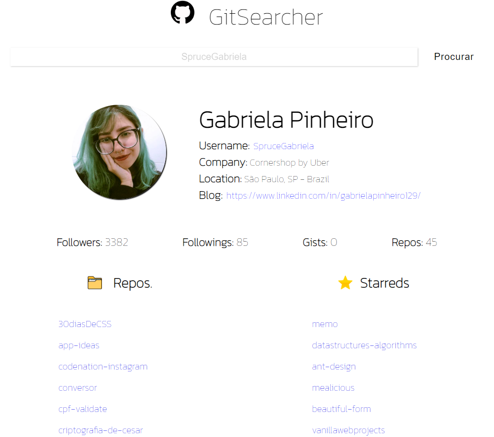
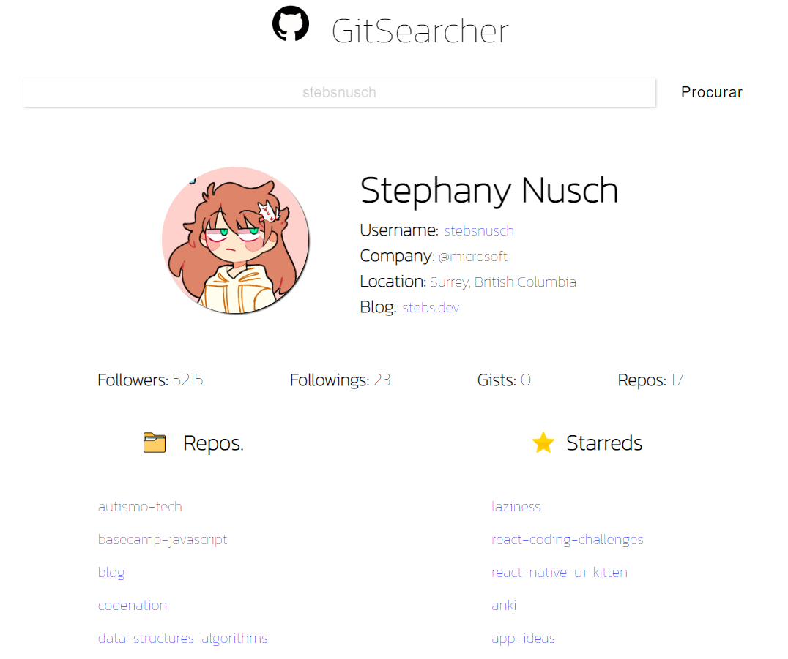

# Modulo 4 concluído - ReactJS :heavy_check_mark:

Finalizado módulo 4 com a conclusão do projeto "Gitsearch", feito de forma toda "componentizada".

Agradecimento especial à todos os professores do Módulo de ReactJS e em especial ao professor Matheus Benites pela aula incrível!

Aprendi muito com todo o conteúdo e descobri o potencial incrível de modularização do ReactJS.

Próximos passos é solidificar ainda mais os conhecimentos da Biblioteca, principalmente nos tópicos:

* Flux
* Redux
* Hooks
* Axios / Fetch API

Projeto disponível na plataforma não contempla a pasta "node_modules", porém a mesma pode ser obtida com o npm.

Extensões utilizadas para a confecção do projeto foram:

* Syled-components
* Axios

Próximo desafio é o MySQL!

Vamos em frente.

